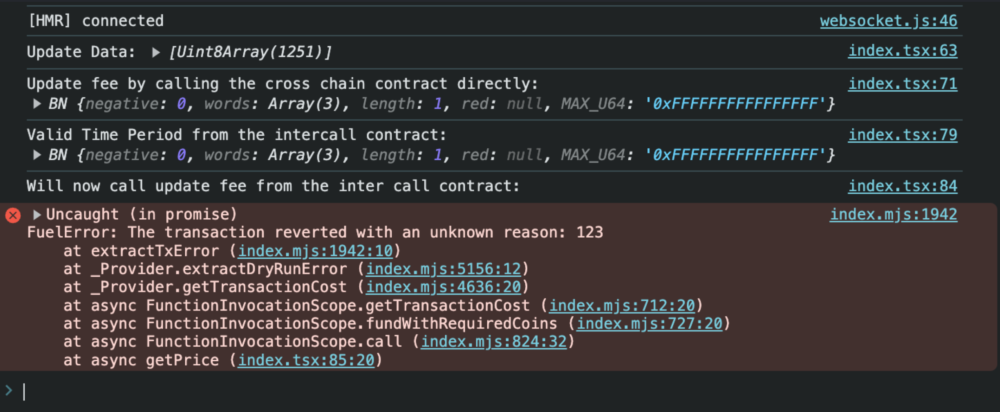

Reproduction for the `The transaction reverted with an unknown reason: 123` error when inter calling a contract.

This example works with testnet and requires the fuel browser wallet extension.

## Installation

1. `npm install`
1. `cp .env.example .env.local`
1. `npm run dev`

## Steps to reproduce

1. Navigate to `http://localhost:3000`
1. Open the developer console
1. Press the fetch button in the middle of the screen

## Information

- The cross chain contact can be found at `pyth-crosschain`
- The inter contract call contract can be found at `sway-programs`
- The TS code that interacts with the contracts can be found at `src/pages/index.tsx`
